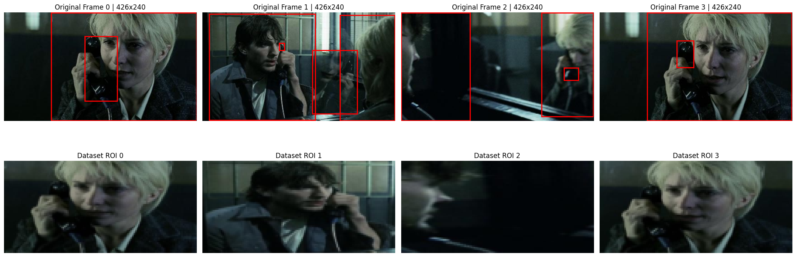

# dnnls_final_project

## Project Overview

This project extends a pre-trained multimodal grounded sequence prediction model with a focus on **frame-aware visual grounding**. The main objective is to investigate whether local visual regions extracted from Chain-of-Thought (CoT) bounding boxes can improve the temporal alignment between ROI embeddings and text embeddings.

The project focuses on two defined architectural components:

1. **Grounding Module**  
   CoT bounding boxes are parsed and converted into frame-specific Region-of-Interest (ROI) patches. These ROI patches are encoded using the visual encoder and used as local visual features.

2. **Alignment / Contrastive Loss**  
   ROI embeddings are aligned with text embeddings using either MSE regression or contrastive InfoNCE learning. The resulting alignment behavior is evaluated using training curves and heatmaps of ROI-text similarity.

The final experiments compare four configurations:

- **No Alignment:** no explicit ROI-text grounding loss
- **MSE Frame-Aware Alignment:** ROI at time step `t` is aligned with the text embedding at time step `t` using MSE
- **InfoNCE Frame-Aare Alignment:** ROI at time step `t` is aligned with the text embedding at time step `t` using contrastive learning
- **Global Matching:** ROI is aligned with an averaged global text context instead of the corresponding time step

## Implementation Summary

### 1. CoT Bounding Box Parsing

The `daniel3303/StoryReasoning` dataset stores grounding information inside the `chain_of_thought` markdown field. I implemented a custom parser that extracts bounding boxes from the markdown tables for each image frame.

During development, the coordinate format was verified through visual sanity checks. The raw CoT bounding boxes match the original image resolution and are therefore treated as direct pixel coordinates in `[x1, y1, x2, y2]` format.

```python
box_matches = re.findall(r'\|\s*([\d,]+)\s*\|', section)

parsed_boxes = []
for match in box_matches:
    coords = [int(c.strip()) for c in match.split(',')]
    if len(coords) == 4:
        parsed_boxes.append(coords)
```

The parsed boxes are stored in a new `parsed_boxes` column using `.map()` so that they can be accessed efficiently during training.

### 2. ROI Extraction

For each context frame, the first available bounding box is used to extract a local region-of-interest (ROI) crop. The final implementation uses the raw pixel coordinates directly without normalization or scaling by image width and height.

```python
x1, y1, x2, y2 = frame_boxes[0]
pixel_bbox = [x1, y1, x2, y2]

roi = crop_and_resize(
    frames[f_idx],
    pixel_bbox,
    out_hw=self.image_hw
)
```

Visual sanity checks were used to compare the raw CoT bounding boxes with the extracted dataset ROIs. This confirmed that the corrected coordinate handling produces meaningful local visual crops.



The top row shows the original frames with raw CoT bounding boxes. The bottom row shows the ROI crops returned by the dataset pipeline.

### 3. Model Integration

The `SequencePredictionDataset` was extended to return `context_rois_tensor` in addition to the original image frames, text descriptions, and prediction targets.

The sequence predictor was then modified to encode the ROI crops using the visual encoder:

```python
if context_rois is not None:
    rois_flat = context_rois.view(batch_size * seq_len, C, H, W)
    z_roi_flat = self.image_encoder(rois_flat)
    z_roi_seq = z_roi_flat.view(batch_size, seq_len, -1)
```

This produces ROI embeddings with shape `[batch, sequence_length, latent_dim]`, which can be aligned with the corresponding text embeddings.

### 4. ROI-Text Alignment Objectives

The alignment target depends on whether frame-aware or global matching is used.

```python
if USE_GLOBAL_MATCHING:
    z_txt_for_alignment = z_t_seq.mean(dim=1, keepdim=True).expand_as(z_t_seq)
else:
    z_txt_for_alignment = z_t_seq
```

For MSE alignment, the ROI embeddings are directly regressed toward the selected text embeddings:

```python
loss_ground_mse = F.mse_loss(z_roi_seq, z_txt_for_alignment)
```

For InfoNCE alignment, matching ROI-text pairs are treated as positives and incorrect temporal pairs as negatives:

```python
z_img = F.normalize(z_roi_seq.reshape(-1, z_roi_seq.size(-1)), dim=-1)
z_txt = F.normalize(
    z_txt_for_alignment.reshape(-1, z_txt_for_alignment.size(-1)),
    dim=-1
)

logits = (z_img @ z_txt.t()) / CONTRASTIVE_TAU
labels = torch.arange(logits.size(0), device=device)

loss_contrast = F.cross_entropy(logits, labels)
```
