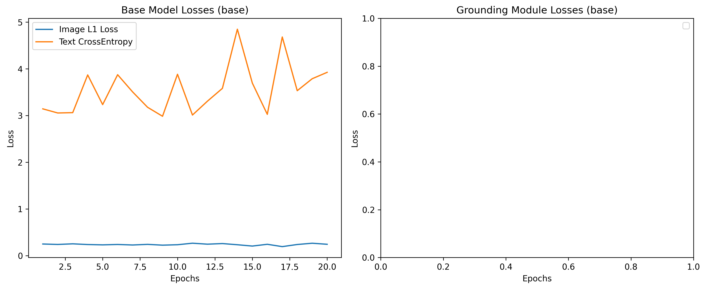
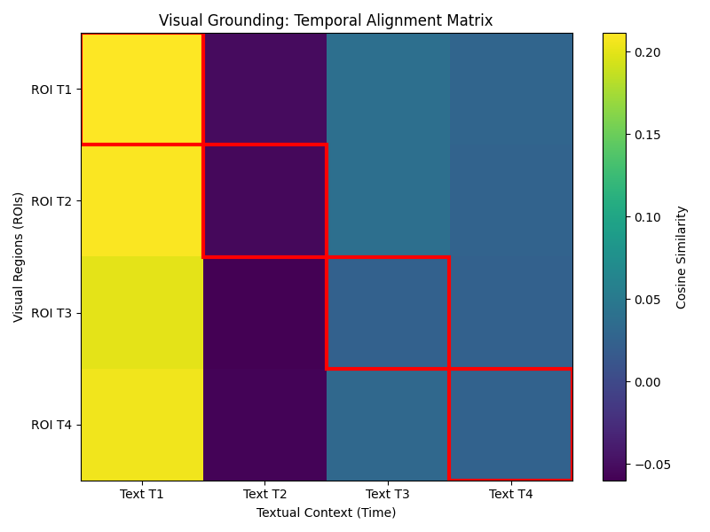
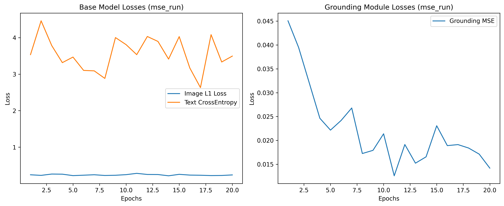
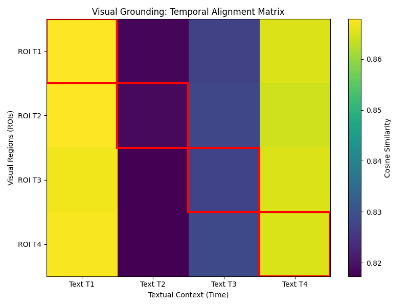
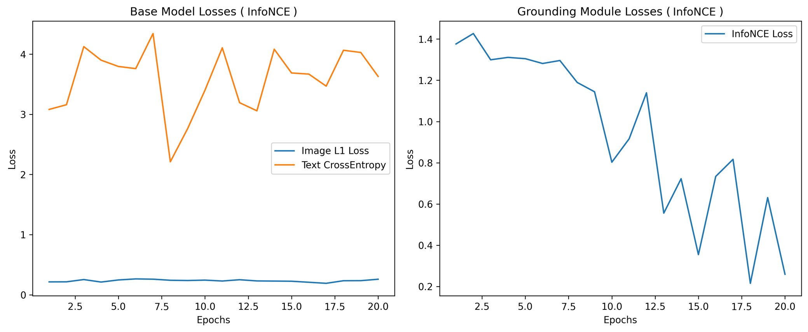
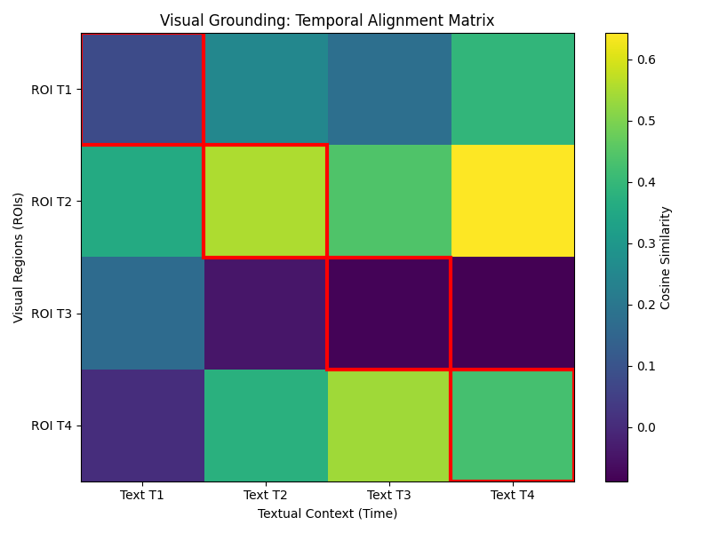
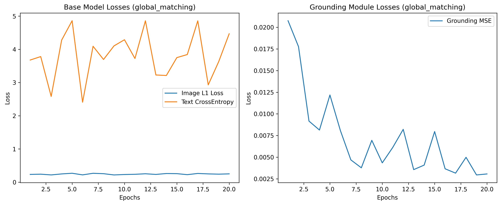
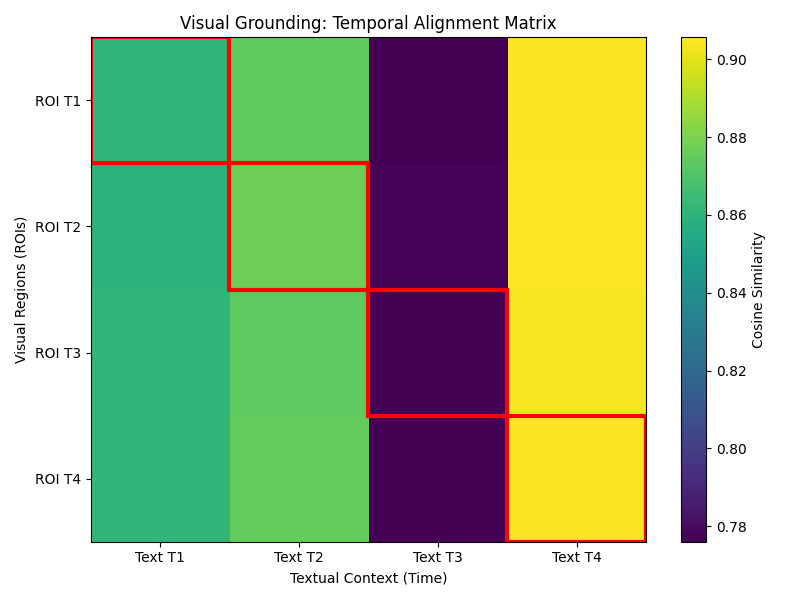

# dnnls_final_project

## Project Overview

This project extends a pre-trained multimodal grounded sequence prediction model with a focus on **frame-aware visual grounding**. The main idea is to test whether local image regions from Chain-of-Thought (CoT) bounding boxes can help the model connect the right visual region with the right text time step.

The project focuses on two defined architectural components:

1. **Grounding Module**  
The CoT bounding boxes are extracted from the dataset and used to crop frame-specific regions of interest (ROIs). These cropped image regions are then encoded with the visual encoder and added as local visual information.

2. **Alignment / Contrastive Loss**  
The ROI embeddings are compared with the text embeddings using either MSE or InfoNCE. I then use training curves and ROI-text similarity heatmaps to check which objective gives a better temporal alignment pattern.

The final experiments compare four configurations:

- **No Alignment:** no explicit ROI-text grounding loss
- **MSE Frame-Aware Alignment:** ROI at time step `t` is aligned with the text embedding at time step `t` using MSE
- **InfoNCE Frame-Ware Alignment:** ROI at time step `t` is aligned with the text embedding at time step `t` using contrastive learning
- **Global Matching:** ROI is aligned with an averaged global text context instead of the corresponding time step

## Implementation Summary

The implementation mainly consists of four steps: extracting the CoT boxes, cropping ROIs, passing the ROIs through the visual encoder, and adding ROI-text alignment losses.

### 1. CoT Bounding Box Parsing

The `daniel3303/StoryReasoning` dataset stores grounding information inside the `chain_of_thought` markdown field. I implemented a custom parser that extracts bounding boxes from the markdown tables for each image frame.

At first, the coordinate format was not completely clear. I therefore checked the raw boxes visually on the original frames. These checks showed that the CoT boxes match the original image resolution, so I treat them as direct pixel coordinates in `[x1, y1, x2, y2]` format.

```python
box_matches = re.findall(r'\|\s*([\d,]+)\s*\|', section)

parsed_boxes = []
for match in box_matches:
    coords = [int(c.strip()) for c in match.split(',')]
    if len(coords) == 4:
        parsed_boxes.append(coords)
```

The parsed boxes are stored in a new `parsed_boxes` column using `.map()` so that they can be accessed efficiently during training.

### 2. ROI Extraction

For each context frame, the first available bounding box is used to extract a local region-of-interest (ROI) crop. The final implementation uses the raw pixel coordinates directly.

```python
x1, y1, x2, y2 = frame_boxes[0]
pixel_bbox = [x1, y1, x2, y2]

roi = crop_and_resize(
    frames[f_idx],
    pixel_bbox,
    out_hw=self.image_hw
)
```

Visual sanity checks were used to compare the raw CoT bounding boxes with the extracted dataset ROIs. This confirmed that the corrected coordinate handling produces meaningful local visual crops.


The top row shows the original frames with raw CoT bounding boxes. The bottom row shows the ROI crops returned by the dataset pipeline.

### 3. Model Integration

The `SequencePredictionDataset` was extended to return `context_rois_tensor` in addition to the original image frames, text descriptions, and prediction targets.

The sequence predictor was then modified to encode the ROI crops using the visual encoder:

```python
if context_rois is not None:
    rois_flat = context_rois.view(batch_size * seq_len, C, H, W)
    z_roi_flat = self.image_encoder(rois_flat)
    z_roi_seq = z_roi_flat.view(batch_size, seq_len, -1)
```

This produces ROI embeddings with shape `[batch, sequence_length, latent_dim]`, which can be aligned with the corresponding text embeddings.

### 4. ROI-Text Alignment Objectives

The alignment target depends on whether frame-aware or global matching is used.

```python
if USE_GLOBAL_MATCHING:
    z_txt_for_alignment = z_t_seq.mean(dim=1, keepdim=True).expand_as(z_t_seq)
else:
    z_txt_for_alignment = z_t_seq
```

For MSE alignment, the ROI embeddings are directly regressed toward the selected text embeddings:

```python
loss_ground_mse = F.mse_loss(z_roi_seq, z_txt_for_alignment)
```

For InfoNCE alignment, matching ROI-text pairs are treated as positives and incorrect temporal pairs as negatives:

```python
z_img = F.normalize(z_roi_seq.reshape(-1, z_roi_seq.size(-1)), dim=-1)
z_txt = F.normalize(
    z_txt_for_alignment.reshape(-1, z_txt_for_alignment.size(-1)),
    dim=-1
)

logits = (z_img @ z_txt.t()) / CONTRASTIVE_TAU
labels = torch.arange(logits.size(0), device=device)

loss_contrast = F.cross_entropy(logits, labels)
```

## Experimental Setup

The final experiments were run on the `daniel3303/StoryReasoning` dataset using the corrected ROI extraction pipeline. The CoT bounding boxes were treated as direct pixel coordinates in `[x1, y1, x2, y2]` format, and the resulting ROI crops were passed through the visual encoder.

Each experiment uses the same overall model pipeline and differs only in the ROI-text alignment configuration.

| Run | Configuration | Purpose |
| :--- | :--- | :--- |
| **No Alignment** | `USE_GLOBAL_MATCHING = False`, `USE_CONTRASTIVE_ROI = False`, `LAMBDA_GROUND_MSE = 0`, `LAMBDA_CONTRAST = 0` | Baseline without explicit ROI-text grounding loss |
| **MSE Frame-Aware Alignment** | `USE_GLOBAL_MATCHING = False`, `USE_CONTRASTIVE_ROI = False`, `LAMBDA_GROUND_MSE = 0.1`, `LAMBDA_CONTRAST = 0`, `ROI_t ↔ Text_t` using MSE | Tests whether direct embedding regression creates temporal ROI-text alignment |
| **InfoNCE Frame-Aware Alignment** | `USE_GLOBAL_MATCHING = False`, `USE_CONTRASTIVE_ROI = True`, `LAMBDA_GROUND_MSE = 0`, `LAMBDA_CONTRAST = 0.1`, `ROI_t ↔ Text_t` using InfoNCE | Tests whether contrastive learning improves temporal discrimination |
| **Global Matching** | `USE_GLOBAL_MATCHING = True`, `USE_CONTRASTIVE_ROI = False`, `LAMBDA_GROUND_MSE = 0.1`, `LAMBDA_CONTRAST = 0`, `ROI_t ↔ mean(Text_1...Text_4)` using MSE | Tests whether removing frame awareness leads to shortcut-like behaviour |

The loss curves are used as diagnostic training indicators. Component losses are interpreted cautiously, because the main evidence for temporal grounding behaviour comes from the ROI-text similarity heatmaps.

A strong diagonal in the heatmap would indicate that the ROI embedding from time step `t` is most similar to the text embedding from the same time step:

```text
ROI T1 ↔ Text T1
ROI T2 ↔ Text T2
ROI T3 ↔ Text T3
ROI T4 ↔ Text T4
```

In contrast, column-wise or non-diagonal patterns suggest weaker temporal discrimination or shortcut-like alignment behaviour.

All experiments were trained for 20 epochs. This was chosen as a practical compromise between training duration, limited free GPU compute in Google Colab, and the need to reserve compute for iterative debugging and validation. In addition to the final controlled runs, several shorter test runs were required to validate the implementation step by step, including the CoT parser, ROI extraction, DataLoader synchronization, model forward pass, and grounding loss integration.

This was especially important because implementation issues, such as incorrect bounding box interpretation, could only be reliably identified through visual sanity checks and test runs. Reserving compute for these checks made it possible to correct the ROI extraction pipeline and re-run the final experiments with verified local crops.

In this setup, a 20-epoch run took approximately 45 minutes, allowing multiple configurations to be compared under the same small-scale training conditions. The goal was therefore not to fully optimize each configuration to convergence, but to compare the alignment behaviour of the different grounding objectives in a controlled and reproducible way.

## Results

The results compare how the model behaves with different ROI-text alignment strategies. I use the training curves as a general training overview, but the most important evaluation is the ROI-text similarity heatmap.

In the heatmaps, the rows represent ROI embeddings and the columns represent text embeddings. A strong diagonal would mean that the ROI from time step `t` is most similar to the text from the same time step. This would be the desired behaviour for temporal grounding.

### Experiment 1: No Alignment vs. MSE vs. InfoNCE

Experiment 1 compares three settings:

1. **No Alignment:** no explicit ROI-text grounding loss
2. **MSE Frame-Aware Alignment:** direct regression between `ROI_t` and `Text_t`
3. **InfoNCE Frame-Aware Alignment:** contrastive learning between correct and incorrect temporal ROI-text pairs

The purpose of this experiment is to test whether explicit ROI-text alignment improves the temporal structure of the shared embedding space.

#### 1.1 No Alignment Baseline

In the no-alignment run, no additional ROI-text grounding loss is used. This means that the model is trained without explicitly learning that a specific ROI should match the text from the same time step.



Since no grounding loss is active in this configuration, the grounding-loss plot is empty. The base losses are still useful as a general training check, but they do not tell us whether ROI-text alignment was learned.



The heatmap does not show a clear diagonal structure. This is expected because the model was not given a direct training signal to align `ROI_t` with `Text_t`.

**Interpretation:**  
This run acts as the baseline. It shows that a clear temporal ROI-text alignment does not appear automatically without an explicit grounding objective.

#### 1.2 MSE Frame-Aware Alignment

In this run, each ROI embedding is directly aligned with the text embedding from the same time step using MSE. This means that the model is encouraged to make `ROI_t` and `Text_t` more similar.

```text
ROI T1 ↔ Text T1
ROI T2 ↔ Text T2
ROI T3 ↔ Text T3
ROI T4 ↔ Text T4
```



The grounding MSE decreases during training, which shows that the model is able to reduce the numerical distance between ROI embeddings and text embeddings.



However, the heatmap does not show a consistently clear diagonal. Some text time steps are still similar to several ROI time steps.

**Interpretation:**
The MSE objective reduces the grounding loss, but this does not automatically mean that the model learned precise temporal alignment. The heatmap suggests that MSE can lead to a simpler or averaged solution, where the embeddings become closer overall but are not clearly separated by time step.

#### 1.3 InfoNCE Frame-Aware Alignment

The InfoNCE run also uses frame-aware matching, but the training signal is different from MSE. Instead of only pulling matching ROI-text pairs closer together, InfoNCE also compares them with incorrect temporal pairs.

This means that the model should learn that `ROI T1` belongs more to `Text T1` than to `Text T2`, `Text T3`, or `Text T4`.



The InfoNCE loss is more variable than the MSE loss, which is expected because the task is more difficult. The model has to distinguish correct pairs from wrong pairs instead of only reducing a direct distance.



The heatmap is not perfectly diagonal, but it shows the most differentiated structure among the Experiment 1 runs. Compared with no alignment and MSE, the similarities are less collapsed and show more temporal separation.

**Interpretation:**  
InfoNCE gives the strongest indication of temporal discrimination in this experiment. This partially supports the hypothesis that contrastive learning is better suited for frame-aware ROI-text alignment than pure MSE regression. The result is still not perfect, but it is the most meaningful alignment pattern among the tested settings.

#### 1.4 Summary

| Run | Main Observation | Interpretation |
| :--- | :--- | :--- |
| **No Alignment** | No clear diagonal structure | No explicit temporal ROI-text alignment objective is active |
| **MSE Frame-Aware** | Grounding MSE decreases, but the heatmap suggests shortcut-like patterns | Low regression loss does not necessarily imply temporal discrimination |
| **InfoNCE Frame-Aware** | Most differentiated heatmap structure | Contrastive learning provides the strongest temporal alignment signal among the tested objectives |

**Key finding:**  
InfoNCE produced the most useful ROI-text similarity structure in Experiment 1. This partially supports the hypothesis that contrastive learning is better suited for frame-aware ROI-text alignment than MSE. At the same time, the MSE run shows that a low grounding loss alone is not enough to prove temporal grounding. The heatmaps are needed to check whether the model actually learns frame-specific ROI-text correspondence.

### Experiment 2: Frame-Aware vs. Global Matching

Experiment 2 tests whether the exact time step matters for ROI-text alignment.

In frame-aware matching, each ROI is aligned with the text embedding from the same time step:

```text
ROI_t ↔ Text_t
```

In global matching, each ROI is aligned with the average text embedding across all context frames:


```text
ROI_t ↔ mean(Text_1, Text_2, Text_3, Text_4)
```

This experiment checks whether the model benefits from a precise temporal matching signal or whether it can use a more general story-level text representation.

#### 2.1 Global Matching

In the global matching run, each ROI is compared with an averaged text context instead of the text from the same time step.



The grounding MSE becomes low, which is not surprising because the task is easier than frame-aware matching. The model only has to align ROIs with a general text representation of the whole context.



The grounding MSE becomes low, which is not surprising because the task is easier than frame-aware matching. The model only has to align ROIs with a general text representation of the whole context.

**Interpretation:**  
Global matching can reduce the numerical grounding loss, but this does not mean that the model learned temporal grounding. Instead, the model can rely on the general story context and does not need to learn which ROI belongs to which exact text time step.

#### 2.2 Summary

| Configuration | Main Observation | Interpretation |
| :--- | :--- | :--- |
| **Frame-Aware Matching** | More difficult alignment objective | Preserves the intended time-step-specific ROI-text relation |
| **Global Matching** | Low numerical grounding error, but no clear diagonal heatmap | Suggests shortcut-like behaviour through averaged text context |

**Key finding:**  
Frame-aware matching is more suitable for temporal grounding because it keeps the intended `ROI_t ↔ Text_t` relation. Global matching can achieve a low grounding loss, but the heatmap suggests that this can happen through a shortcut using the averaged text context instead of precise temporal alignment.

## Overall Findings

Overall, the experiments show that adding ROI-based grounding changes the way the model connects visual regions and text embeddings. However, the results also show that a low grounding loss alone is not enough to prove good temporal grounding.

The no-alignment run showed that clear ROI-text alignment does not appear automatically without an explicit grounding objective. The MSE run reduced the numerical grounding loss, but the heatmap did not show a consistently clear temporal alignment pattern. This suggests that MSE can make embeddings closer overall without clearly separating the different time steps.

The InfoNCE run produced the most useful ROI-text similarity structure in this project. It was not perfectly diagonal, but it showed the strongest indication that the model learned to distinguish correct and incorrect temporal ROI-text pairs.

The global matching run showed that removing frame awareness can make the grounding objective easier, but this does not necessarily lead to better temporal grounding. Even if the numerical grounding loss becomes low, the model can rely on an averaged story context instead of learning the exact `ROI_t ↔ Text_t` relation.

The main conclusion is therefore:

> InfoNCE is the most promising alignment objective in this setup, because it encourages temporal discrimination between correct and incorrect ROI-text pairs. MSE and global matching can also reduce numerical losses, but the heatmaps show that this does not automatically mean that the model learned precise temporal grounding.

## Limitations

There are several limitations in this project.

1. The CoT bounding boxes are not perfect. Some boxes capture useful local regions, but others cover large parts of the image or do not isolate one specific character or object very precisely. Therefore, the ROI crops should be seen as helpful local visual context, but not as perfect object-level annotations.

2. The experiments were run in a small-scale setup. I used 20 epochs for each final run because of limited free GPU compute in Google Colab and because several test runs were needed to debug and validate the implementation. This means that the models were compared under the same conditions, but not fully optimized to convergence.

3. The loss curves are used mainly as training diagnostics. They show whether the model is training and whether the grounding loss decreases, but they do not fully prove temporal grounding. For this reason, the ROI-text similarity heatmaps are more important for interpreting the alignment behaviour.

4. The heatmaps can show whether the embedding space has a more useful temporal structure, but they do not prove that the model fully understands the story or reliably recognizes identities across frames.

5. The image generation quality remains limited. The generated images tend to be blurry or averaged, so this project focuses more on embedding alignment and temporal ROI-text correspondence than on visual output quality.

## Conclusion

This project added a frame-aware grounding extension to a multimodal sequence prediction model. CoT bounding boxes were used to extract local ROI crops from the image frames, and these ROIs were encoded as additional local visual features.

The experiments showed that MSE and global matching can reduce the numerical grounding loss, but this does not automatically mean that the model learns precise temporal grounding. The ROI-text similarity heatmaps were therefore important for checking whether the model actually learned a useful time-step-specific structure.

Overall, InfoNCE produced the most useful ROI-text similarity pattern in this setup. It was not perfect, but it gave the strongest indication that contrastive learning can help the model distinguish correct and incorrect ROI-text pairs over time.

The final result is therefore best understood as a partial but meaningful improvement in temporal ROI-text alignment, rather than a complete solution to grounded story understanding.

## AI Transparency Statement

AI has been directed for enhanced development of concepts and outputs.

| AITS | Descriptor | Transparency Statement | AI Contributions | Human Contribution |
| :--- | :--- | :--- | :--- | :--- |
| 3 | AI for Developing | AI has been directed for enhanced development of concepts and outputs. | AI is used to undertake detailed development of many or most aspects of an activity and outputs of that activity. | The human takes a significant role in the enhancement, refinement, and critical review of AI generated elements, combining or curating for any outputs. |